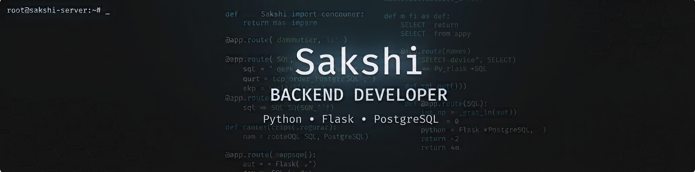

  

<h1 align="center">Hi, I'm Sakshi </h1>

<h3 align="center">
Backend Developer • Python • Flask • PostgreSQL
</h3>

I'm focused on building backend systems and understanding how they work under the hood — from authentication and database transactions to testing and production deployment.

---

Featured Project

<h3 align="center">Candy Vending Machine API</h3>

  A production-oriented Flask backend built around real-world backend concepts.

  
  

    
 Try the deployed application- Candy Vending Machine Live - https://candy-vending-machine.onrender.com
    

What I've worked with

- JWT authentication and authorization
- PostgreSQL and database migrations with Alembic
- Wallets, transactions and ledger records
- Database connection pooling
- pytest API testing with a separate test database
- Gunicorn and Nginx
- HTTPS/TLS, CA certificates and HSTS
- Production configuration and application logging

---

Tech Stack

Languages

Python · JavaScript · SQL

Backend

Flask · SQLAlchemy · REST APIs

Databases

PostgreSQL · SQLite

Testing

pytest

Deployment

Gunicorn · Nginx · Linux/WSL

Tools

Git · GitHub · Alembic

---

Currently Learning

- Automated testing and CI/CD
- Production database performance
- Redis
- Docker
- Backend architecture

---

Interests

Backend engineering, systems with real business logic, and eventually AI and embedded/IoT systems.

---

Open To

Backend development and internship opportunities.
